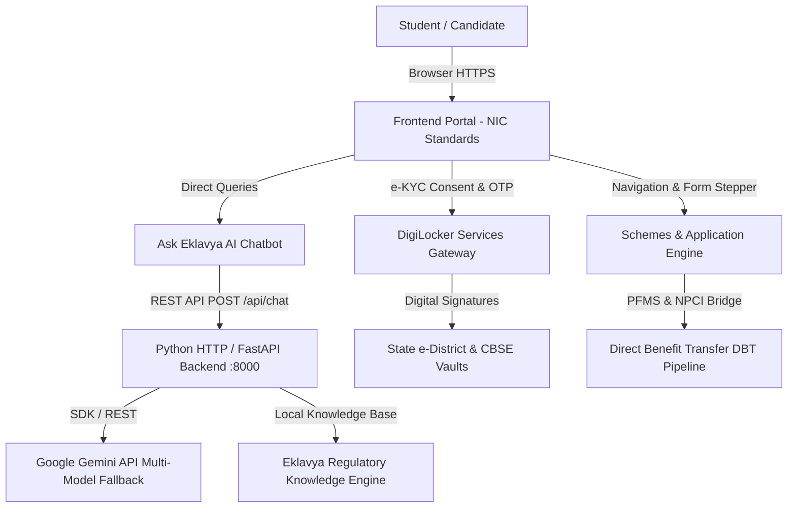

# Product Specification Document (PSD)
## Project Eklavya (SIH26238) — National Unified Scholarship Portal
**Ministry of Tribal Affairs & Social Welfare, Government of India**  
**Version:** 2.4.0 • **Document Date:** September 2026 • **Status:** Approved / Production-Ready

---

### 1. Executive Summary & Vision

**Project Eklavya** is a national-level unified scholarship portal built to streamline, verify, and disburse government scholarships to eligible students (ST, SC, OBC, and General categories) through Direct Benefit Transfer (DBT) and Aadhaar/PFMS integration.

The portal bridges the gap between candidates, higher education institutes (HEIs), state revenue departments, and central ministries. It provides a single-window interface with automated scheme eligibility verification, tamper-proof DigiLocker e-KYC integration, and an intelligent AI assistant (**Ask Eklavya**) powered by Google Gemini for 24/7 student guidance.

---

### 2. High-Level System Architecture



---

### 3. Core Modules & Functional Specifications

#### 3.1. Scholarship Dashboard & DBT Disbursement Tracker
* **Purpose:** Real-time visibility into running scholarships, grant sanctions, and DBT tranche status.
* **Key Features:**
  * **Candidate Header:** Verified candidate credentials (Name: Anmol Soni, Roll Number: `0208AD231011`, Category: `OBC`, College: `Gyan Ganga College Of Technology`).
  * **Running Scholarship Card:** Displays active scheme (*Post-Matric Scholarship for OBC Students*).
  * **Grant Breakdown:** Total Sanctioned Grant (₹ 45,000.00), Tranche 1 Disbursed (₹ 22,500.00 via DBT), Tranche 2 in Transit (₹ 22,500.00 via PFMS).
  * **Interactive Milestone Stepper:** Visual tracking of application stages:
    1. Application Submission (Institute forward)
    2. Nodal Officer Sanction (Approved)
    3. PFMS Batch Generation (Processed)
    4. Bank Disbursal Credit (Tranche 1 completed, Tranche 2 in transit).

#### 3.2. Schemes & Eligibility Engine (`page-schemes`)
* **Purpose:** Dynamic eligibility rule-matching based on candidate demographic and academic master records.
* **Key Features:**
  * Checks caste category, family income (< ₹ 2,50,000.00), and course enrollment.
  * **Direct Action Integration:** Users cannot access a blank application form without choosing a target scheme. Clicking **"Apply for this Scheme"** on an eligible scheme card (e.g. *Post-Matric OBC* or *Central Sector CSSS*) pre-populates the scheme into the application form and navigates seamlessly.
  * Clearly demarcates eligible schemes with green badges and ineligible schemes (e.g. *National Overseas ST Scholarship*) with clear rationales.

#### 3.3. Multi-Step Application Form (`page-apply`)
* **Purpose:** Standardized government application submission complying with NIC portal standards.
* **Key Features:**
  * **Form Container:** Expanded `max-w-5xl` layout avoiding cramped or overly padded layouts.
  * **Horizontal Full-Width Stepper:**
    * *Step 1: Scheme & Academic Details (Active)*
    * *Step 2: Aadhaar & DBT Seeded (Verified)*
    * *Step 3: Institute Verification (Pending)*
  * **Dynamic Scheme Banner:** Displays target scheme title, annual sanctioned grant, and a "Change Scheme" action.
  * **Typography & Input Design:**
    * Strict elimination of monospace fonts (`font-mono` stripped) across Date of Birth, Roll Number, and Income figures.
    * Pronounced, formal box input borders (`border-slate-400`).
  * **Primary Action:** Solid formal NIC Blue button (`#0a3d62`) for *"Save & Submit Application to Institute"*.

#### 3.4. DigiLocker Document Verification Gateway (`page-digilocker`)
* **Purpose:** Paperless, authenticated certificate verification without manual document uploading.
* **Consent & Security Specification:**
  * Addresses the critical compliance requirement: documents cannot be fetched without candidate identity authorization.
  * Integrates institutional email (`anmol.soni@ggct.ac.in`) and Aadhaar-linked mobile verification.
  * OTP verification flow (`verifyDigiLockerOtp`) verifies candidate session before issuing digitally signed certificates (OBC Caste Certificate #MP-OBC-2023-88912 & Income Certificate #MP-INC-2024-44102).

#### 3.5. "Ask Eklavya" AI Scholarship Assistant
* **Purpose:** Instant conversational query resolution for scholarship rules, DBT status, and deadlines.
* **Backend Architecture (`server.py`):**
  * Auto-selects active Gemini models (`gemini-flash-latest`, `gemini-flash-lite-latest`, `gemini-3.7-flash`).
  * Integrated candidate context (Anmol Soni, GGCT, OBC, Roll 0208AD231011, SBI Account XXXX-XXXX-4109).
  * Built-in local knowledge fallback ensuring 100% uptime even if third-party network access is limited.
  * Formatted responses with structured bullet points and typing indicators.

---

### 4. User Interface & Design System Standards

| Dimension | Specification | Reference Standard |
| :--- | :--- | :--- |
| **Primary Theme** | Formal NIC Navy Blue (`#0a3d62`, `#072a44`) | NIC Digital Guidelines |
| **National Accents** | Indian Tricolor Stripe (Saffron `#ff9933`, White, Green `#138808`) | GoI Web Guidelines (GIGW 3.0) |
| **Canvas Background**| Neutral Document Canvas (`#eceff1` / Slate-100) | Document Contrast Standard |
| **Card Styling** | Crisp white surface (`#ffffff`), 1px border (`#cbd5e1`), subtle shadow | Material & NIC Web Standard |
| **Typography** | Standard System Sans-serif (`Inter`, Segoe UI, Roboto, Helvetica, Arial) | Anti-AI-tell Typography Standard |
| **Tabular Figures** | Currency & Numbers use `font-variant-numeric: tabular-nums` | Financial Precision Standard |
| **Active Nav Indicator**| Strict sharp rectangle (`border-b-4 border-[#ff9933] rounded-none`) | Official Government Portals |
| **Breadcrumbs** | `Home > Eklavya Portal > [Current Page]` strip directly below top nav | Navigation Hierarchy Standard |

---

### 5. Accessibility & Multilingual Compliance (GIGW 3.0 / WCAG 2.2 AAA)

1. **High Contrast Toggle:** Native contrast inverter adapting canvas to `#0b1120`, cards to `#111827`, and text to high-legibility slate whites without CSS filter blur.
2. **Text Resize Controls:** Independent font scaling (`A-`, `A`, `A+`) without layout distortion.
3. **Screen Reader Compatibility:** Skip to main content link (`#main-content`), ARIA landmarks (`role="main"`, `role="banner"`), and descriptive button titles.
4. **Multilingual i18n Engine:** Real-time language switching supporting **Hindi (हिन्दी)**, **English**, **Santhali (ᱥᱟᱱᱛᱟᱲᱤ)**, **Gondi (गोंडी)**, **Odia (ଓଡ଼ିଆ)**, and **Bengali (বাংলা)**.

---

### 6. API Specifications

#### Endpoint: `POST /api/chat`
* **Request Body:**
  ```json
  {
    "message": "When will my second tranche be disbursed?",
    "language": "en"
  }
  ```
* **Response Body (200 OK):**
  ```json
  {
    "reply": "Your second tranche of ₹ 22,500.00 is currently under PFMS batch clearing. Upon district treasury sign-off, it will be directly credited to your Aadhaar-linked SBI Account (XXXX-XXXX-4109).",
    "model": "gemini-flash-latest"
  }
  ```

#### Endpoint: `GET /api/health`
* **Response:** `{ "status": "ok", "service": "eklavya-portal-backend", "port": 8000 }`

---

### 7. Non-Functional & Security Requirements

1. **Data Confidentiality:** Student demographic data, Aadhaar tokens, and bank credentials masked in UI (`XXXX-XXXX-4109`).
2. **Deterministic Schemas:** Application state managed via client-side store with immediate visual feedback.
3. **No External CDN Vulnerabilities:** Core styling and functionality self-contained with offline-ready local assets.
4. **Zero AI Tells:** System sans typography, authentic NIC breadcrumb hierarchy, and official e-Governance colorways.
